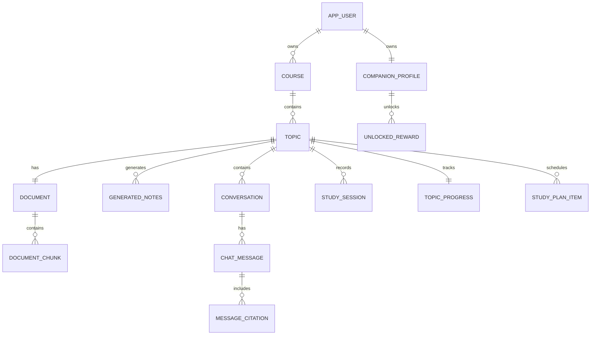

# FocusBuddy Database Design

## Database Overview

FocusBuddy uses PostgreSQL as its primary database.

The database stores:

- Users
- Courses
- Lecture Topics
- Uploaded PDFs
- AI Generated Notes
- AI Conversations
- Study Sessions
- Study Planner
- Progress
- Companion Rewards

---

# Main Business Rules

- One user owns many courses.
- One course belongs to exactly one user.
- One course contains many topics.
- One topic belongs to exactly one course.
- One topic represents exactly one lecture.
- One topic contains exactly one uploaded PDF.
- PDFs cannot belong to multiple topics.
- Topics cannot belong to multiple courses.
- Uploading a PDF automatically creates a new Topic.
- Generated notes are NOT editable.
- One topic may have multiple AI conversations.
- Each conversation contains many chat messages.
- AI answers should include PDF page citations whenever possible.
- Users can complete multiple study sessions.
- Every user has one Companion Profile.

---

# Entity Relationships

```text
AppUser
│
├── Course
│      ├── Topic
│      │      ├── Document
│      │      │      └── DocumentChunk
│      │      │
│      │      ├── GeneratedNotes
│      │      ├── Conversation
│      │      │      └── ChatMessage
│      │      │              └── MessageCitation
│      │      │
│      │      ├── StudySession
│      │      ├── StudyPlanItem
│      │      └── TopicProgress
│
└── CompanionProfile
        └── UnlockedReward
```

---

# Entities

## AppUser

Represents a registered student.

| Field |
|--------|
| id |
| email |
| passwordHash |
| displayName |
| createdAt |
| updatedAt |

Relationships

- One User → Many Courses
- One User → Many Conversations
- One User → Many Study Sessions
- One User → Many Planned Sessions
- One User → One Companion Profile

---

## Course

Represents one university subject.

Examples

- Operating Systems
- Databases
- Networking
- Signal Processing

| Field |
|--------|
| id |
| ownerId |
| name |
| description |
| color |
| createdAt |
| updatedAt |

Relationships

- One Course → Many Topics

---

## Topic

A Topic represents ONE lecture.

Topic = Lecture = One PDF.

Examples

- Processes
- Virtual Memory
- SQL Joins
- Fourier Transform

| Field |
|--------|
| id |
| courseId |
| title |
| description |
| position |
| status |
| createdAt |
| updatedAt |

Statuses

- NOT_STARTED
- LEARNING
- REVIEWING
- CONFIDENT

Relationships

- One Topic → One Course
- One Topic → One Document
- One Topic → Many Generated Notes
- One Topic → Many Conversations
- One Topic → Many Study Sessions
- One Topic → One Topic Progress

---

## Document

Stores PDF metadata.

One Topic has exactly ONE PDF.

| Field |
|--------|
| id |
| topicId |
| originalFilename |
| storedFilename |
| storagePath |
| mimeType |
| fileSize |
| pageCount |
| processingStatus |
| uploadedAt |
| processedAt |

Statuses

- UPLOADED
- PROCESSING
- READY
- FAILED

Relationships

- One Document → Many Document Chunks

---

## DocumentChunk

Stores pieces of extracted PDF text.

Used for Retrieval-Augmented Generation (RAG).

| Field |
|--------|
| id |
| documentId |
| pageNumber |
| chunkIndex |
| content |
| embedding |
| createdAt |

Relationships

- Many Chunks → One Document

---

## GeneratedNotes

Stores AI-generated notes.

Notes are NOT editable.

| Field |
|--------|
| id |
| topicId |
| mode |
| content |
| createdAt |
| updatedAt |

Modes

- QUICK_REVISION
- DETAILED_EXPLANATION
- EXAM_PREPARATION

Each Topic can have one note for each mode.

---

## Conversation

Represents one AI chat.

A Topic may have multiple chats.

Examples

- General Questions
- Exam Preparation
- Explain This Formula

| Field |
|--------|
| id |
| topicId |
| userId |
| title |
| createdAt |
| updatedAt |

Relationships

- One Conversation → Many Chat Messages

---

## ChatMessage

Stores messages inside a conversation.

| Field |
|--------|
| id |
| conversationId |
| role |
| content |
| createdAt |

Roles

- USER
- ASSISTANT
- SYSTEM

---

## MessageCitation

Stores references used by AI answers.

Example

Source: Page 18

| Field |
|--------|
| id |
| chatMessageId |
| documentChunkId |
| pageNumber |
| displayText |

---

## StudySession

Represents one completed study session.

| Field |
|--------|
| id |
| userId |
| topicId |
| goal |
| plannedDurationMinutes |
| actualDurationSeconds |
| status |
| startedAt |
| endedAt |
| createdAt |

Statuses

- PLANNED
- ACTIVE
- PAUSED
- COMPLETED
- CANCELLED

---

## StudyPlanItem

Represents a future planned study session.

| Field |
|--------|
| id |
| userId |
| topicId |
| title |
| scheduledStart |
| plannedDurationMinutes |
| completed |
| createdAt |

---

## TopicProgress

Stores overall learning progress.

| Field |
|--------|
| id |
| userId |
| topicId |
| status |
| totalStudySeconds |
| completedSessions |
| lastStudiedAt |
| updatedAt |

Statuses

- NOT_STARTED
- LEARNING
- REVIEWING
- CONFIDENT

---

## CompanionProfile

Stores user companion information.

| Field |
|--------|
| id |
| userId |
| focusPoints |
| selectedAccessory |
| selectedBackground |
| createdAt |
| updatedAt |

---

## UnlockedReward

Stores unlocked companion rewards.

| Field |
|--------|
| id |
| companionProfileId |
| rewardCode |
| rewardType |
| unlockedAt |

Reward Types

- ACCESSORY
- BACKGROUND
- DECORATION
- BADGE
- BOOK
- PLANT

---

# Mermaid ER Diagram



---

# First Backend Implementation

The first feature to implement will only include:

- Course
- Topic
- Document

First user flow:

```text
Create Course
      ↓
Open Course
      ↓
Upload Lecture PDF
      ↓
Create Topic
      ↓
Create Document
      ↓
Display Topic inside Course
```

After that, implement in this order:

1. DocumentChunk
2. GeneratedNotes
3. Conversation
4. ChatMessage
5. MessageCitation
6. StudySession
7. TopicProgress
8. StudyPlanItem
9. CompanionProfile
10. UnlockedReward